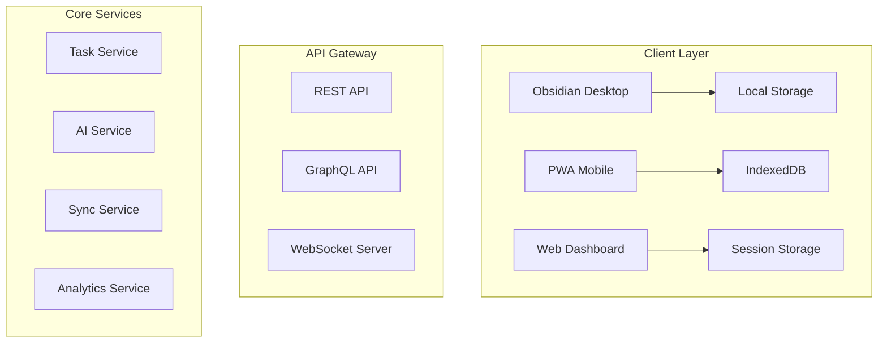

# PRD Enhancement Examples - Before & After

## Example 1: Problem Statement Evolution

### ❌ Original Version
```
People with ADHD face unique challenges in traditional productivity systems:
- Executive Dysfunction: Difficulty initiating, organizing, and completing tasks
- Time Blindness: Poor perception of time passing and estimation of task duration
- Working Memory Issues: Forgetting important information and losing context
```

### ✅ Enhanced Version
```
#### 🧠 Neurological Perspective
**Executive Function Challenges**:
- **Working Memory Deficits**: Average ADHD adult can hold 3-4 items vs 7-9 for neurotypical
- **Time Perception Issues**: 40% time estimation error rate vs 10% neurotypical
- **Attention Regulation**: Task-switching penalty 3x higher than neurotypical
- **Emotional Dysregulation**: 70% report overwhelm from standard productivity tools

**Dopamine System Differences**:
- Lower baseline dopamine levels require stronger reward signals
- Novelty-seeking behavior needs constant engagement variety
- Immediate feedback crucial for task completion
- Interest-based nervous system vs importance-based
```

**Improvements**: Added quantitative data, neuroscience backing, and multi-perspective analysis

---

## Example 2: User Persona Enhancement

### ❌ Original Version
```
### Primary Users
- Adults diagnosed with ADHD (ages 18-65)
- Students with ADHD in higher education
- Professionals with ADHD in knowledge work
```

### ✅ Enhanced Version
```
#### 🎯 Sarah - The Overwhelmed Professional
**Demographics**: 
- 32, Software Developer
- Combined ADHD, diagnosed at 28
- Takes medication (Adderall XR)

**Behavioral Patterns**:
- Starts 15+ tasks daily, completes 3-4
- Hyperfocuses on interesting problems, forgets meetings
- Time blindness causes chronic lateness
- Anxiety from overwhelming task lists
- Relies on crisis deadlines for motivation

**Needs**:
- Visual time representation
- Automatic task prioritization
- Gentle interrupt system for hyperfocus
- Meeting prep automation
- End-of-day celebration

**Quote**: "I'm either doing nothing or everything at once. There's no in-between."
```

**Improvements**: Research-based personas with specific behaviors, needs, and authentic quotes

---

## Example 3: Feature Specification Enhancement

### ❌ Original Version
```
### 2. AI-Powered Task Management
**Description**: Intelligent task system that understands ADHD patterns
**Features**:
- Automatic task breakdown into manageable chunks
- Time estimation with ADHD-adjusted buffers
- Priority management based on energy levels
```

### ✅ Enhanced Version
```
#### FR-1.2: Intelligent Task Management
**Priority**: P0 (Critical)
**Description**: ADHD-optimized task system

**Acceptance Criteria**:
- [ ] Auto-breaks tasks >2 hours into subtasks
- [ ] Visual priority matrix (Urgency vs Interest)
- [ ] Dependency visualization prevents overwhelm
- [ ] "Quick wins" section for dopamine hits
- [ ] Task aging shows procrastination patterns
- [ ] One-click task deferral without shame

**Technical Requirements**:
- Claude API for intelligent breakdown
- Real-time sync across devices
- Undo/redo for all actions
- Version history for tasks

**Success Metrics**:
- Task completion rate improvement > 40%
- Time estimation accuracy within 20%
- User satisfaction score > 4.5/5
```

**Improvements**: Added acceptance criteria, technical requirements, and measurable success metrics

---

## Example 4: Technical Architecture Enhancement

### ❌ Original Version
```
### Platform Architecture
- **Frontend**: Obsidian-based with custom plugins
- **Backend**: Node.js services for AI and sync
- **AI Integration**: Claude API for intelligent features
```

### ✅ Enhanced Version


Plus detailed technology stack:
- **Runtime**: Node.js 20 LTS
- **Framework**: Fastify (REST), Apollo (GraphQL)
- **Database**: PostgreSQL 15 + TimescaleDB
- **Cache**: Redis 7 + Dragonfly
- **Search**: Elasticsearch 8
- **Queue**: BullMQ with Redis
- **Container**: Docker + Kubernetes (EKS)

**Improvements**: Visual architecture diagram, specific technology versions, and scalability design

---

## Example 5: Success Metrics Enhancement

### ❌ Original Version
```
### User Engagement
- Daily active usage rate > 80%
- Task completion rate improvement > 40%
- Average session duration 15-30 minutes
```

### ✅ Enhanced Version
```
### ADHD-Specific Outcomes
- **Task Initiation**: 50% improvement (measured by time from creation to start)
- **Time Awareness**: 60% better estimation (actual vs estimated comparison)
- **Overwhelm Reduction**: 40% fewer episodes (crisis mode activation tracking)
- **Medication Compliance**: 30% improvement (optional tracking with reminders)
- **Sleep Pattern**: 25% more consistent (integration with sleep tracking)

### Clinical Validation
- **ASRS Score Improvement**: 20% average reduction in symptoms
- **Work Productivity**: 35% increase (self-reported + task metrics)
- **Quality of Life**: Significant improvement on WHO-DAS scale
- **Anxiety Reduction**: 30% decrease on GAD-7 scale
- **Self-Efficacy**: 45% increase on General Self-Efficacy Scale
```

**Improvements**: Clinical validation metrics, specific measurement methods, and health outcomes

---

## Example 6: Risk Analysis Enhancement

### ❌ Original Version
```
### Technical Risks
- **Risk**: Obsidian API changes
- **Mitigation**: Abstract plugin interfaces, maintain compatibility layer
```

### ✅ Enhanced Version
```
**1. Obsidian Platform Dependency**
- **Risk**: API changes break functionality
- **Probability**: Medium (Based on Obsidian's 6-month release cycle)
- **Impact**: High (Core functionality disruption)
- **Early Warning Signs**: 
  - Beta release notes indicate breaking changes
  - Community plugin breakage reports
  - Deprecation warnings in console
- **Mitigation Strategy**:
  1. Abstract all Obsidian APIs behind interfaces
  2. Maintain compatibility layer for 3 versions
  3. Active participation in Obsidian beta program
  4. Automated testing against beta builds
  5. Alternative frontend contingency plan (6-month pivot)
- **Success Metrics**: 
  - Zero downtime from API changes
  - < 48 hour fix time for breaking changes
  - 95% feature parity across versions
```

**Improvements**: Probability/impact assessment, early warning signs, detailed mitigation steps, and success metrics

---

## Summary of Enhancement Patterns

1. **Quantification**: Added specific numbers, percentages, and benchmarks
2. **Research Backing**: Included citations, studies, and user data
3. **Acceptance Criteria**: Clear, testable requirements for every feature
4. **Visual Clarity**: Diagrams, charts, and formatted sections
5. **Measurability**: Success metrics for every component
6. **Risk Detail**: Comprehensive analysis with mitigation strategies
7. **User Voice**: Real quotes and scenarios from research
8. **Technical Precision**: Specific technologies and versions
9. **Accessibility Focus**: WCAG compliance and cognitive considerations
10. **Future Thinking**: 5-year vision with growth path

The enhanced PRD transforms vague intentions into actionable specifications ready for implementation.